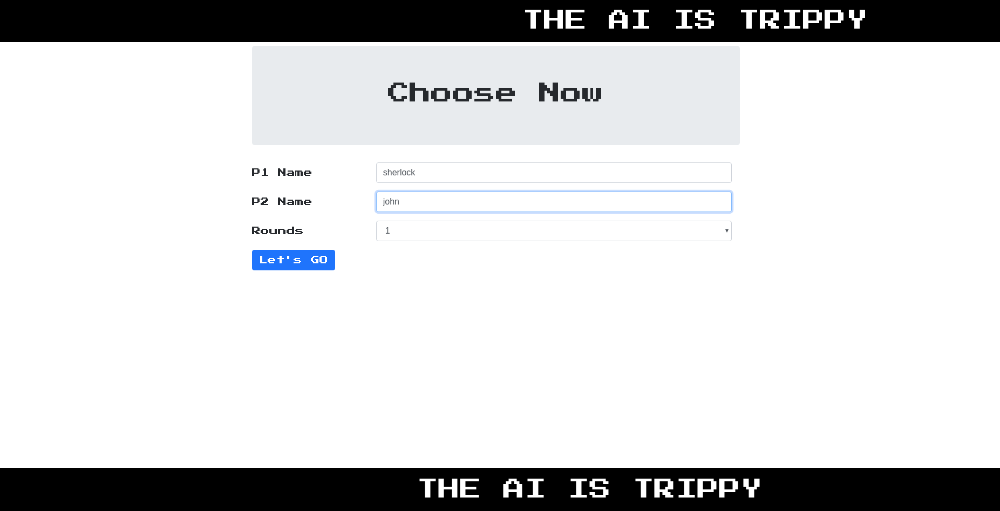
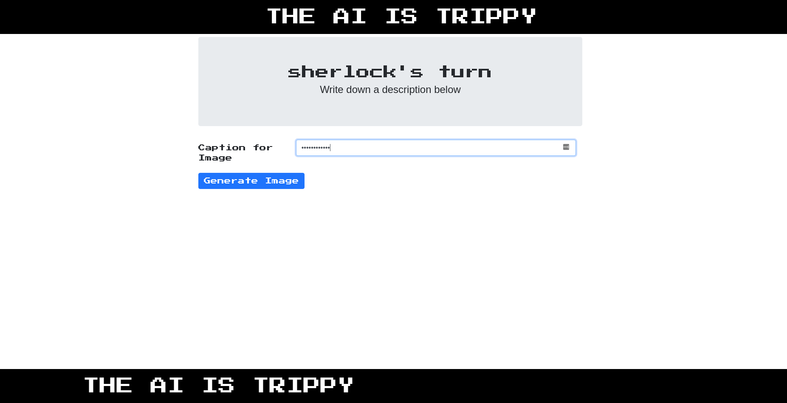
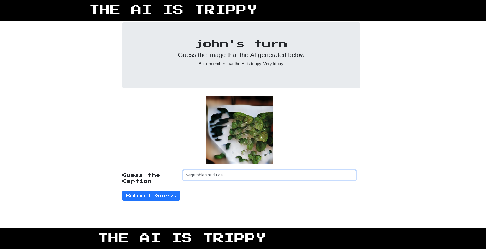
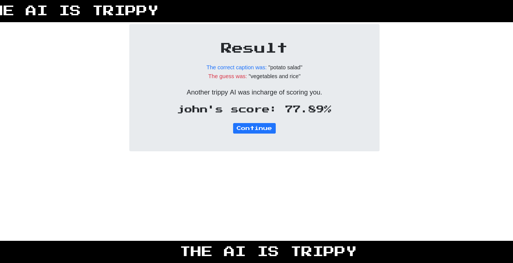
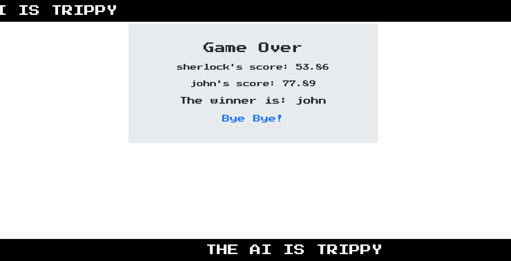
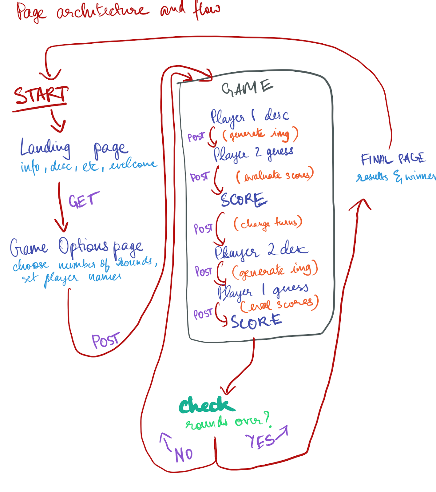

# RePictionary
## What is this?
RePictionary is a fun 2 player game (read: Reverse Pictionary) in which users type in descirptions of images that are generated by an [attnGAN](https://github.com/taoxugit/AttnGAN) and guess each other's image descriptions. The scoring is done using sentence similarity with [spaCy](https://spacy.io)'s word vectors. 
## How it looks like
Here are some images of the interface of the game. I used some retro fonts and the age-old marquee tags to give it a very nostalgic feel. Follow along as two great minds try to play the game. 

#### Choose basic game setting to begin

#### First player gets to type in a caption to generate an image

#### Second player must guess the image that was GANarated

#### Scores are assigned based on how similar the guess was to the original caption

#### After repeating, the winner is announced. Hooray!

## How does it work?
### Image generation
The image generation is done using an attnGAN, as described in [AttnGAN: Fine-Grained Text to Image Generation with Attentional Generative Adversarial Networks](http://openaccess.thecvf.com/content_cvpr_2018/papers/Xu_AttnGAN_Fine-Grained_Text_CVPR_2018_paper.pdf) by Tao Xu, Pengchuan Zhang, Qiuyuan Huang, Han Zhang, Zhe Gan, Xiaolei Huang, Xiaodong He. It uses a pytorch implementation of the model as done in [this repo](https://github.com/taoxugit/AttnGAN) with additional modifications from [this repo](https://github.com/sleebapaul/attnGAN). A high level architecture of the GAN is described in the image below. ([source](https://github.com/taoxugit/AttnGAN))

The model uses [MS CoCo](http://cocodataset.org/) dataset, a popular dataset of images used for object and image recognition along with a range of other topics related to computer vision.

### The scoring
For the scoring part, I used the age-old sentence similarity provided by [spaCy](https://spacy.io). It uses word vectors to provide cosine similarity of the average vectors of the entire sentence. To avoid giving high scores to semantic similarity and place more importance of the actual content, I modified the input to the similarity function as described in [this]() StackOverflow answer. The results looked pretty promising to me.

### The web interface
The entire web interface was created using [Flask](http://flask.pocoo.org/). The front-end design was done with [Bootstrap 4](https://getbootstrap.com/docs/4.0/getting-started/introduction/). The picture below is a rough sketch of the artitecture and the game logic specific to the web application. 

Details that are lacking here can be found by reading through the code, most of the relavant stuff is written in [`app.py`](./app.py). There are various routes and majority of the game data is passed using POST requests to the server. There is no database and game data such as scores are store as global variables, mostly since the project was a short term project for which I did not really need to create a database to do many things.  

## Potential Improvements
- Obviously, the image generation is very sloppy. I would like to train the model using a specific domain of images. For example, only food images would be a fun way to proceed, given that I am able to find a decent dataset or compile one on my own. 
- The generation of the image takes roughly 2 seconds or so. I don't think there's a way to speed that part up but maybe it'd be nice to have a GIF or animation play while the image is being generated. 
- Add a live score-tracking snippet on the side of the webpage to let users keep track of their scores on all pages. 
- Try out other GAN models and see how they perform in text-to-image generation. Of particular interest would be the StackGAN++, an earlier iteration of the AttnGAN. 
